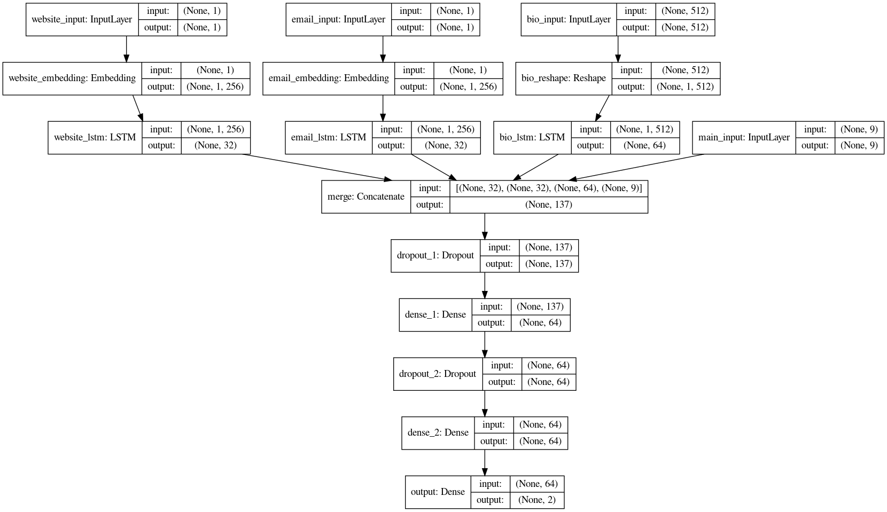

# LodBrok model

LodBrok is an LSTM model trained to detect the editor spam accounts in [MusicBrainz](https://musicbrainz.org/doc/MusicBrainz_Database/Schema). The model trained so far is done through offline batch training on the private editor dataset and will be integrated with [MusicBrainz](https://musicbrainz.org/) project through [SpamNinja](https://tickets.metabrainz.org/browse/MBS-9480) feature in the future.

## Network layout



Lodbrok receives four different inputs which are sub-arrays of the pre-processed input datum. The website and email inputs have respectively been tokenized to their top 1024 entries and are embedded into 256-dimensional vectors. Meanwhile, the user biography input is just reshaped into one 512-dimensional vector, as it is already quasi-embedded.

All three inputs are then passed into LSTMs where the bio-LSTM has an output twice as large as the others.

The outputs of the LSTMS are then concatenated with the other inputs (area set, non-zero privs, bio length, etc.) and passed into a stack of two fully-connected layers with 64 neurons and 50% dropout each.

The output layer consists of two neurons that represent the classification confidence for each category (spam and non-spam) and are activated using softmax so that their sum will always be one.


## Working

First, run the below command in a virtual environment(venv) with the terminal active in the root directory.

Install Python 3 requirements.
```
pip3 install -r requirements.txt
```

How to run each file in every folder is covered in the respective README.md.

### Datasets generated and used

**Note:** For handling datasets, please create a different virtual environement, go to data/README.md for information.

More details regarding datasets can be found [here](data/README.md)

### Model training

More details regarding model training can be found [here](models/README.md)

### Model evaluation and prediction

More details regarding evaluation and prediction can be found [here](evaluation/README.md)


In summary, the Lodbrok model achieves a very high spam detection rate while simultaneously maintaining a low false-positive rate. Data falsely classified by the model should be further examined to determine whether it really is part of the right dataset or whether there is a deficit of a certain type of data.


