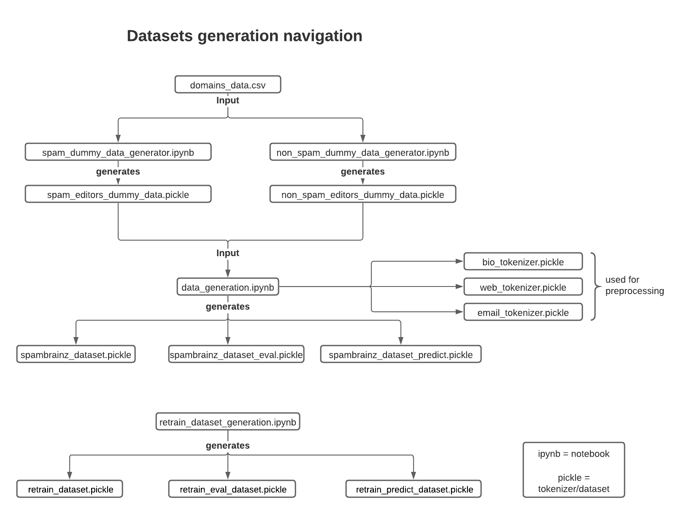

# Datasets generated and used:

### Files used and directory navigation

- This picture explains all the pickle, notebook files used in the data directory which works as the backbone for all the files in evaluation and models.
- If one wants to access all the pickles files without going through each notebook. they can just run the ```../get_pickles.py```.
    -  Note: It overwrites all the files if already present, kindly keep a backup.
- Only the files ```non_spam_editors_dummy_data.pickle``` and ```spam_editors_dummy_data.pickle``` are in human-readable form, rest all are preprocessed for the machine to understand.



### How to use:

- Create a new virtual environment "data_gen" in this directory and install all the libraries listed in ```requirements_dummy_data.txt```.

```
pip3 install -r requirements_dummy_data.txt
```

- Run the jupyter notebook in a virtual environment:

```
jupyter notebook
```

- After this, any notebook can be run in jupyter notebook environment as per your choice.

## Spam and Non Spam dummy data creation:

- The current files are used to generate dummy data to be fed into LodBrok model for testing/training puposes. The file ```spam_dummy_data_generator``` and ```non_spam_dummy_data_generator``` notebook are used to create the eleven paramaters of spam and non-spam editor accounts respectively required for LodBrok, namely: 

    * email
    * website
    * bio
    * area
    * privs
    * gender
    * birth_date
    * member_since
    * email_confirm_date
    * last_updated
    * last_login_date 

The file uses the spam and non-spam domains of emails and websites obtained through research and collaboration. Rest all parameters are purely synthetic which are generated through analysis of editor accounts. All the parameters are generated and stored in a pickle file to be used later to train the model.

The test data generated is also kept in this folder, which has 10000 values each for spam and non_spam datasets. In that, 8000 values are used to train the model and 500 values are used to evaluate the trained model. About 100 values are used to test the model and see it's predictions. The data generated are stored in pickle files which take about 100 MB of data storage.

## Dataset generation for model:

- The notebook ```dataset_generation``` combines both the dataset generated by ```non_spam_dummy_data_generator```,  ``spam_dummy_data_generator`` and then does preprocessing to be fed into the model.

- Preprocessing done:
 
    - The preprocessing is done by considering if certain parameters(spam, area, gender, birthdate, privs) are filled or not and for some parameters (website, email, bio) separate keras tokenizers are used.

```
data = np.array([
        spam, # spam classification
        editor["area"] is not None, # Area Set
        editor["gender"] is not None, # Gender
        editor["birth_date"] is not None, # Birth date set
        editor["privs"] != 0, # Nonzero privs
        bio_len, # Bio length
        bio_urls, # URLs in bio
        conf_delta, # Confirmation delta
        update_delta, # Last updated delta
        login_delta, # Last login delta
        email_token, # Email domain
        website_token, # Website domain
    ], dtype=np.float32)
    
```

    This is then combined with bio and after converting the whole dataset it is then kept in a pickle file 

```
data = np.concatenate((data, bio))

with open("spambrainz_dataset.pickle", "wb") as f:
    pickle.dump(data, f)
```

- Similar preprocessing is done by ```../utils/preprocessing.py``` to preprocess for retraining the model.

- After combining and preprocessing the three different datasets are created for our use, namely:

    * ```spambrainz_dataset.pickle``` for training the model.
    * ```spambrainz_dataset_eval.pickle``` for evaluating the model.
    * ```spambrainz_dataset_predict.pickle```, test data for prediction.


## Dataset generation for retrained model:

- Similar to ```dataset_generation``` notebook, for retraining the model ```retrain_dataset_generation``` is used. 
- Here preprocess_editor of ```../utils/preprocessing.py``` is used to do the preprocessing.
- The datasets generated are:
    * ```retrain_dataset.pickle``` for training the model.
    * ```retrain_eval_dataset.pickle``` for evaluating the retrained model.
    * ```retrain_predict_dataset.pickle``` for evaluating the retrained model.
