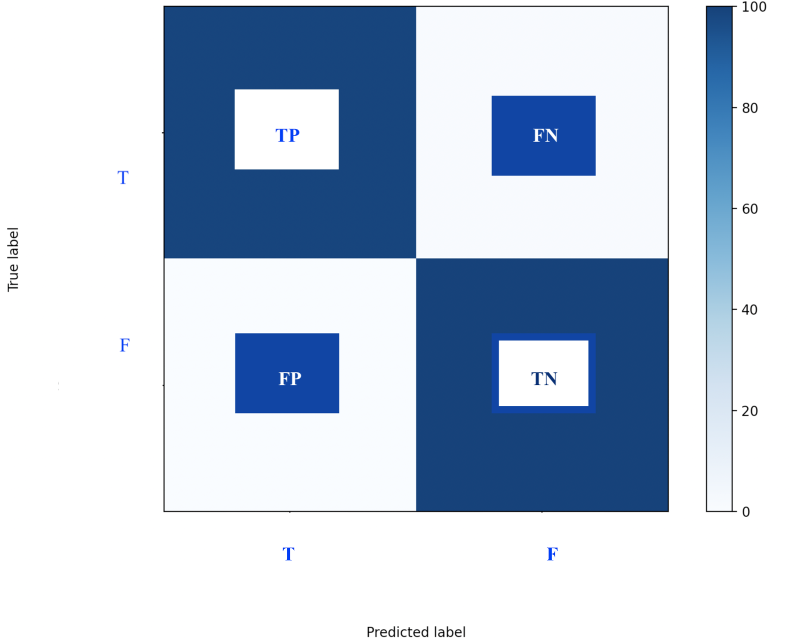
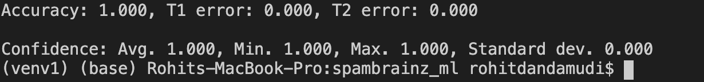
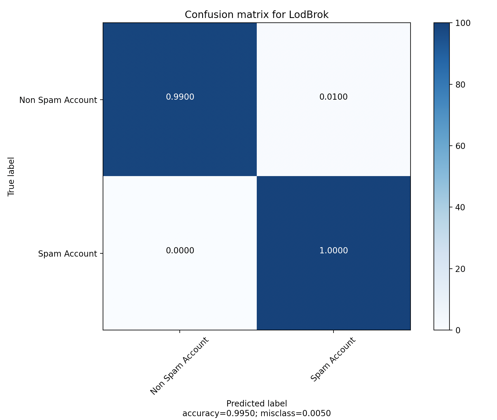
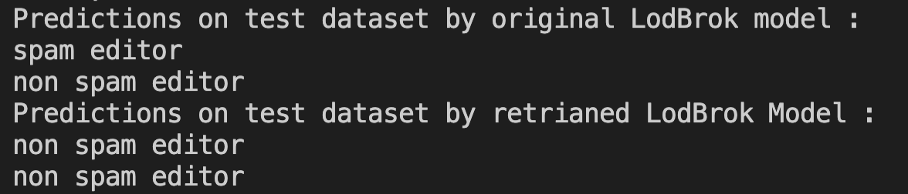
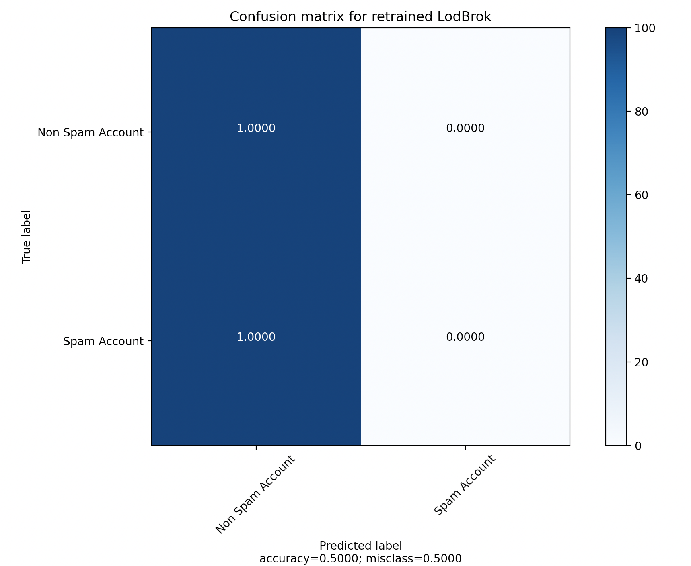

# Evaluation and Prediction:

The evaluation folder covers both model performance when evaluated and prediction done by the model with test data.

- The model predictions are shown in a [visual manner using a confusion matrix](https://en.wikipedia.org/wiki/Confusion_matrix). Each row of the matrix represents the instances in a predicted class while each column represents the instances in an actual class (or vice versa). The name stems from the fact that it makes it easy to see if the system is confusing two classes (i.e. commonly mislabeling one as another).



- Where: P = Positive; N = Negative; TP = True Positive; FP = False Positive; TN = True Negative; FN = False Negative.


## LodBrok model

### Lodbrok model evaluation

- how to use? 
    ``` python3 eval.py```

- A pickle file is created to evaluate the model that we trained, this is stored in ```../data/spambrainz_dataset_eval.pickle``` file. 

- It is then evaluated with the model we saved earlier in ```eval.py```. This will show how accurately the model fairs against the eval data. This is useful to avoid overfitting or underfitting the model.

This is the result of evaluation done on eval_dataset:



### LodBrok model prediction

- how to use? 
    ``` python3 check_predict.py```

- New dataset named ```../data/spambrainz_dataset_predict.pickle``` is used to test the model predictions and how accurate it is with new data.

- The ```check_predict.py``` predicts the data given without any label specifying the type of editor account.

- The results are shown in an easy-to-view manner by testing against the dataset via a confusion matrix. Refer above explaination on what a confusion matrix is if needed.
    - how to use? 
        ``` python3 create_confusion_matrix.py```


 
- The file ```create_confusion_matrix.py``` is used to create the above image, here the blue quarters represent the cases which the model predicted correctly. As once can see there is a 100% accuracy(50% in TP[Non Spam] and 50% in TN[Spam]) for classification of spam and non_spam editor accounts.


## Retrained LodBrok Model: 


### Retraining: 

- The model is retrained to explore online learning for sustained spam account prediction. This is done by exploring various papers, keras community, and stack overflow. 

- In the end, making the model learn with a **slow static learning rate** i.e 0.001 would help the model learn new common spam accounts while still being able to remember it's old learnings of what is spam and what is not.

- More information regarding how this is simulated can be found [here](../models/README.md)

### Retrained Lodbrok model evaluation:


- how to use? 
    ``` python3 eval_retrain.py```

- A pickle file is created to evaluate the model that we trained, this is stored in ```../data/retrain_eval_dataset.pickle``` file. 

- It is then evaluated with the model we saved earlier in ```eval_retrain.py```. This will show how accurately the model fairs against the eval data. This is useful to avoid overfitting or underfitting of the model.

This is the result of evaluation done on eval_dataset:


## Retrained Lodbrok model prediction: 

- The model then is used to predict one spam and non-spam account according to the previous model, but due to retraining, the model learns that what features make it a spam account while still being able to remember what non_spam account is. These predictions are done on new dataset ```../data/retrain_predict_dataset.pickle``` which the model has never seen. 
    - how to use? 
        ``` python3 retrain_check_predict.py```

- The below picture explains how the retrained model was able to achieve that.


- The confusion matrix (Refer above explaination on what a confusion matrix is if needed)bdone against ```../data/spambrainz_dataset_predict.pickle``` also shows how the 50% data is wrong (50% FP[Spam accouts]) after retraining, which tells how the model was able to predict spam accounts as non_spam accounts while still being able to correctly predict non_spam accounts(50% TP[spam accouts]) as non_spam indicating remembrance of previous knowledge. 
     - how to use? 
        ``` python3 create_confusion_matrix.py```




